<h1 align="center">FiveM Weapons Edit 🔫</h1>

### [Español]()

### [English]()

---

 

Para poder editar las texturas como el modelo 3D primero necesitaremos algun sowftare de visionado. En este caso el más conocido y mas facil de usar es..

### [Open IV](https://openiv.com/)

---
 

## ¿ Como empezar ?

Tras descargarnos el software necesitaremos un archivo RPF [¿que es un archivo RPF?](https://filext.com/es/extension-de-archivo/RPF), se puede hacer de manera manual pero es algo complicado. En la carpeta **assets** dejo uno de prueba.

## Paso 1 👩‍💻

Para empezar nos meteremos en el area de trabajo del **OpenIV**, abriendo el programa y haciendo click en **Windows**

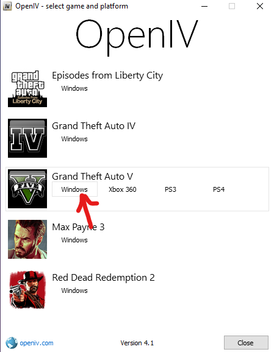)

⚠ No edites estos archivos, ya que son del GTA V base.

↓ Esta es la area de trabajo ↓

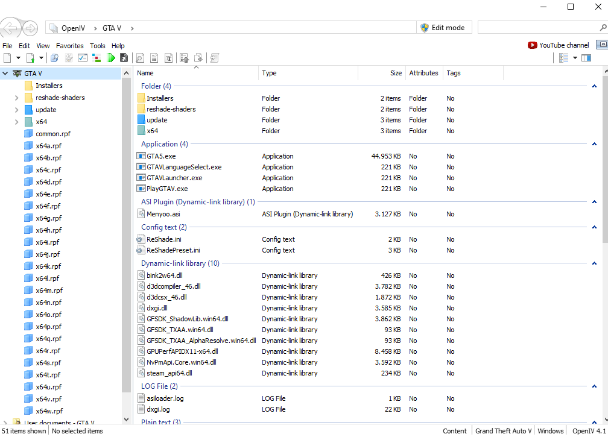

## Paso 2 📁

Lo siguiente es entrar en la carte de los mods de FiveM

La ruta suele ser esta → %USERPROFILE%\AppData\Local\FiveM\FiveM.app\mods

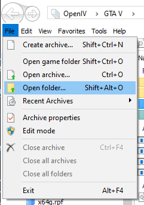

Ya abierta la carpeta nso saldran todos los mods que tenemos en el FiveM instalados. Trabajaremos con **example.rpf**

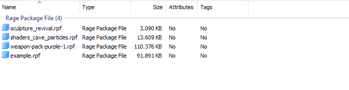

Ahora procederemos a entrar dentro de las subcarpetas hasta que nos aparezca esta con todos los archivos.

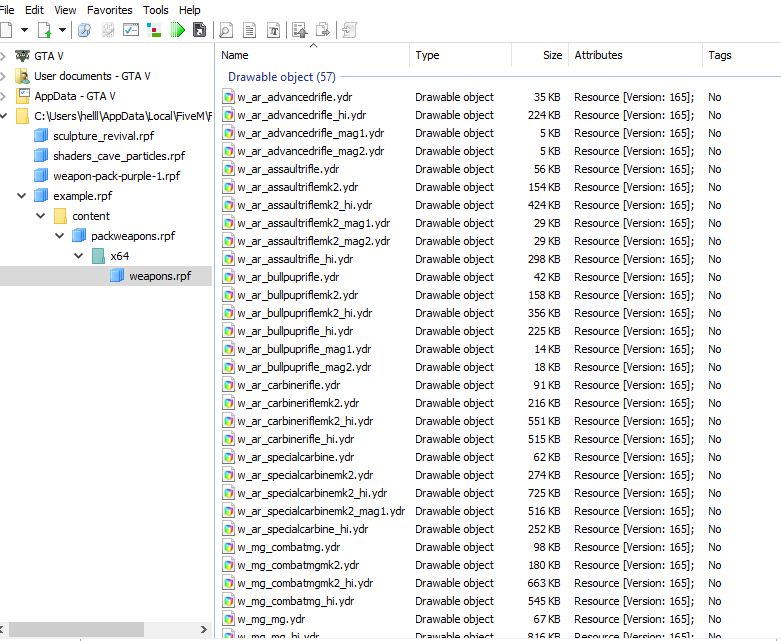

## Paso 3 

En esta carpeta podemos identificar dos tipos de archivos.

### YDR
 

Los YDR son archivos de modelo 3D de las armas.

(Nota: *Este paquete ya esta editado para facilitar el visionado de las skins y modelos 3D*)

Para ver el modelo del arma deberas dar doble click sobre su archivo YDR

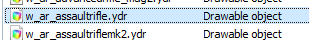
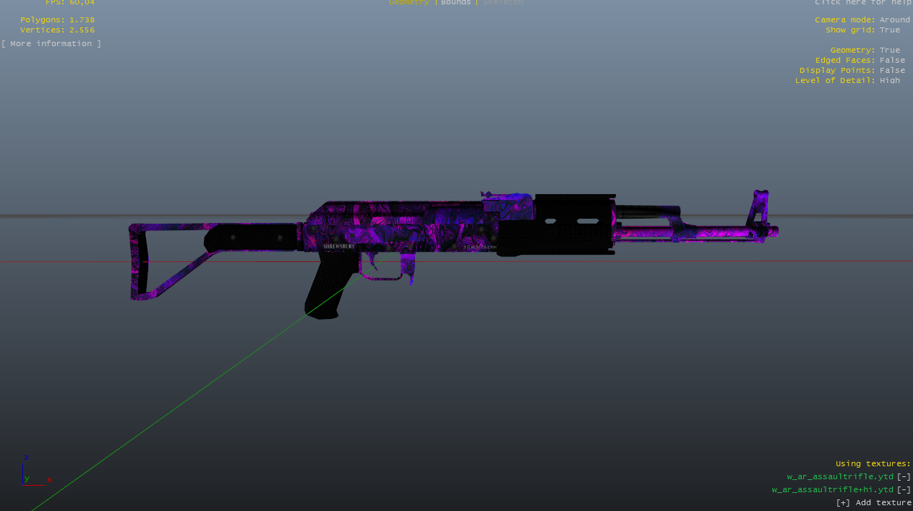

### YTD
 

Los YTD son archivos de modelado de texturas. Son los encargados de darle color y diseño a las armas.
Estos son los que casi siempre se cambian. Estos archivos se aplican a los YDR. 

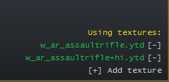

En el editor tenemos la posibilidad de ver las texturas y modificarlas.

Tenemos dos visiones, la de la derecha son todas las texturas del archivo y el panel de la izquierda es el visionado de las texturas.

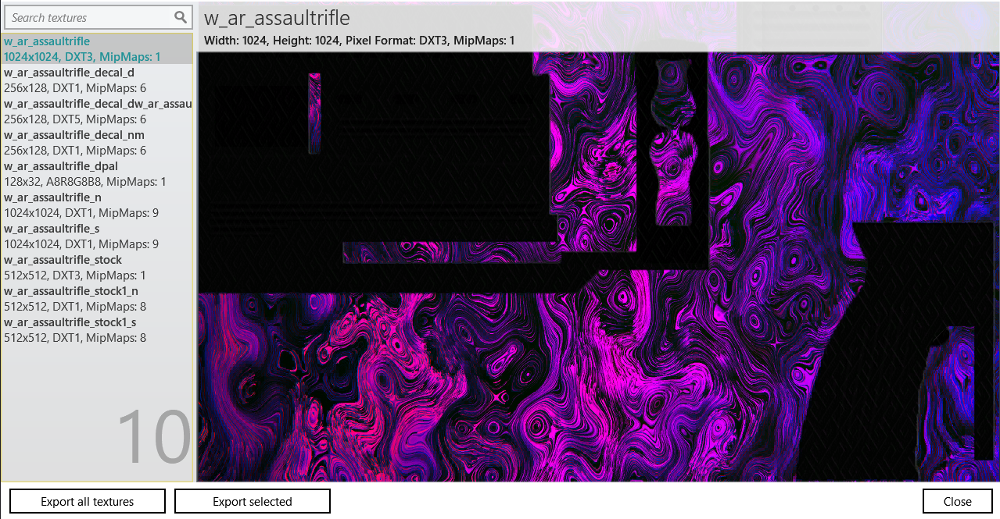

Para poder importar y exportar las imagenes para editarlas debemos activar el **Edit Mode**

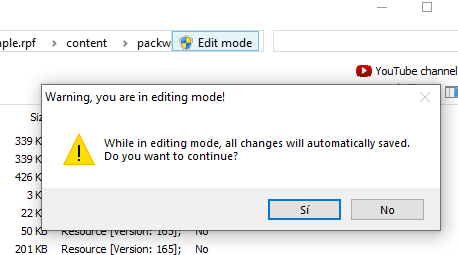

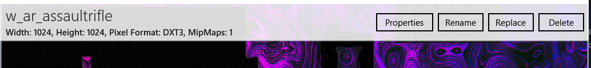

## Paso 4 

Ahora que conocemos los tipos de archivos llega lo divertido. Editar estos archivos.

Podemos editarlos nosotros mismos exportando sus texturas y cambiandolas en algun software de edición o descargarlas de la red.

Recomiendo esta pagina → https://es.gta5-mods.com/weapons

Cuuando descarguemos el arma que nos guste nos dejara seguramente una carpeta de archivos YDR junto con YTD, para la skin solo necesitamos los YTD pero se recomienda usar todos los archivos. Aquí un ejemplo.

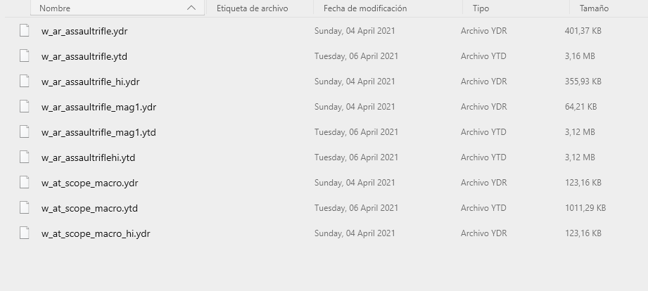

Pues para cambiar nuestra skin por la descargada es tan facil como arrastrar los archivos dentro del Open IV

⚠ Recordar poner el **Edit Mode**

Y asi quedaria el cambio.

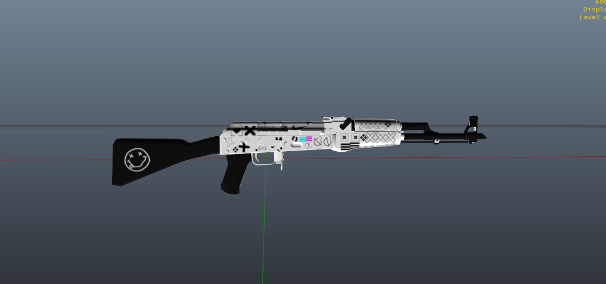

## Paso 5

Cuando cambies los archivos y compruebes que el YDR muestra la nueva skin solo queda entrar a un servidor y probarlo 😊

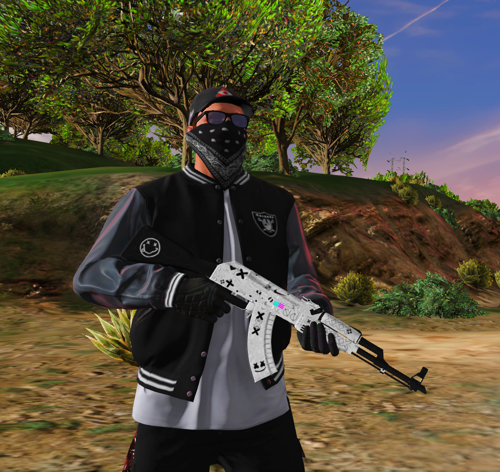